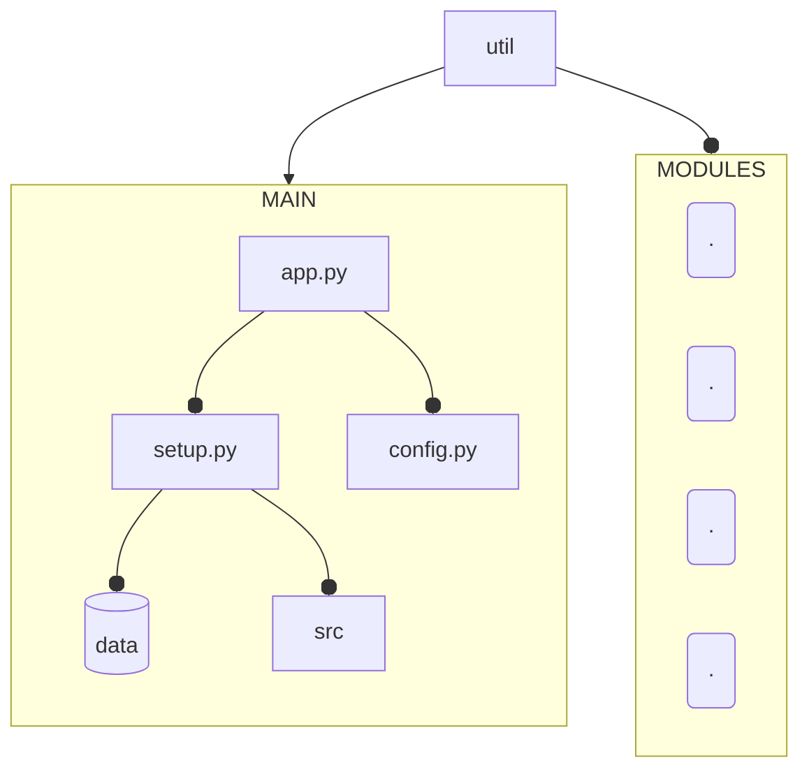

# CONFIDANT

Pure python, no dependency, no nonsense database application.


***Important Note*** : This application is a little hobby project of mine and emerged as a request from my wife to find key information about.. well, basically "everything that is needed to be known" in case of emergency.

> *at the moment, it is functional but quite unstable, so if you want to use it, please proceed with caution* 


## Installation

Simply clone the repository with:

```bash
git clone https://github.com/cem-cookie/confidant 
```

then:
```bash
cd confidant
python -m app
```


## Aim of the Confidant
create a flexible, versatile and secure database applicaion with no external
dependencies except python builtin library and with choice of command line or graphic interface.

### GUI implementation
Altough default app behavior and usage is based on terminal environment, gui will be added and be made optional for people who prefer graphics over text. Why forced to choose when you can have both, right ?

## Architecture
Design and usage of this application may be a bit confusing but it does follow a procedure.
Main interface is controlled by *app.py*, which is served by *setup.py* and sometime *config.py* to access necessary control flows, operations and constants. All data related to applicaiton is contained in **data** folder.

Database related operations in general is controlled by *base.py*. This module is simply the heart of databases created. If one wishes to go deeper and and work on column,row or data operations individually, your module will be *data.py*, which holds all functions for data manipulation in database and works around, over and under the *base.py*. Both modules can be found in ***src*** 

### Illustration of Operation Hierarchy


___

### Why not just use AI?

As mentioned above, this is a fun hobby project and is being built on the principle of "learn as you do". It is a good opportunity to experiment with some techniques and notions of python and its "batteries included" philosophy. I would like to see how far I can push this.

___


### What to expect from v2 

* gui (with [tkinter](https://docs.python.org/3/library/tkinter.html))
* encryption layer (heavy but necessary)
* password gateway
* sql type inference by keyword (for example if name is given as column name, system will automatically infer that it is going to be TEXT, buy age will be INTEGER etc.)

___

### *Any help or suggestion would be much appreciated. So, ***don't be shy***.*
